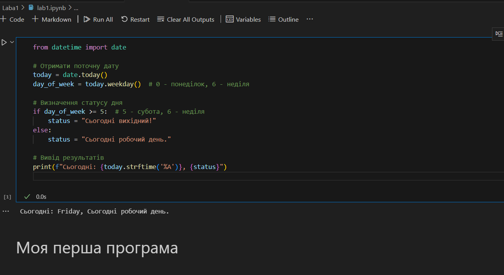

# Звіт до першої лабораторної
## Тема: перша програма на мові *Python*

### Виконання роботи
- Результати виконання завдання:
    1. Виконали першу програму, результат виконання: ;
    1. Модифікували програму та використали [Python Notebook для її виконання](lab1.ipynb);
    
    
    
    1. Програма вивела значення
    1. Отримано наступні результати Сьогодні: Friday, Сьогодні робочий день.
    1. Навчились прості програми на мові Python


___


```Python
from datetime import date

# Отримати поточну дату
today = date.today()
day_of_week = today.weekday()  # 0 - понеділок, 6 - неділя

# Визначення статусу дня
if day_of_week >= 5:
    status = "Сьогодні вихідний!"
else:
    status = "Сьогодні робочий день."

# Вивід результатів
print(f"Сьогодні: {today.strftime('%A')}, {status}")


```
